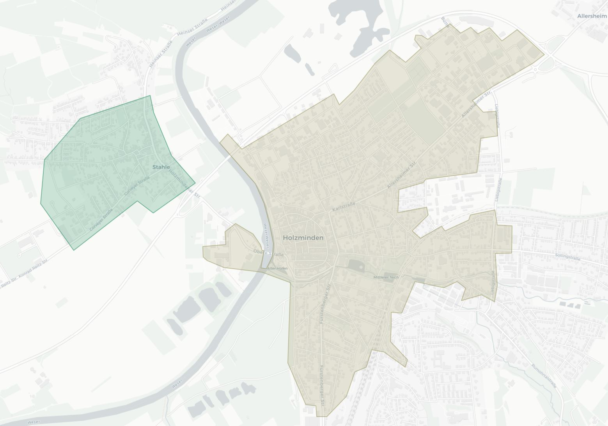
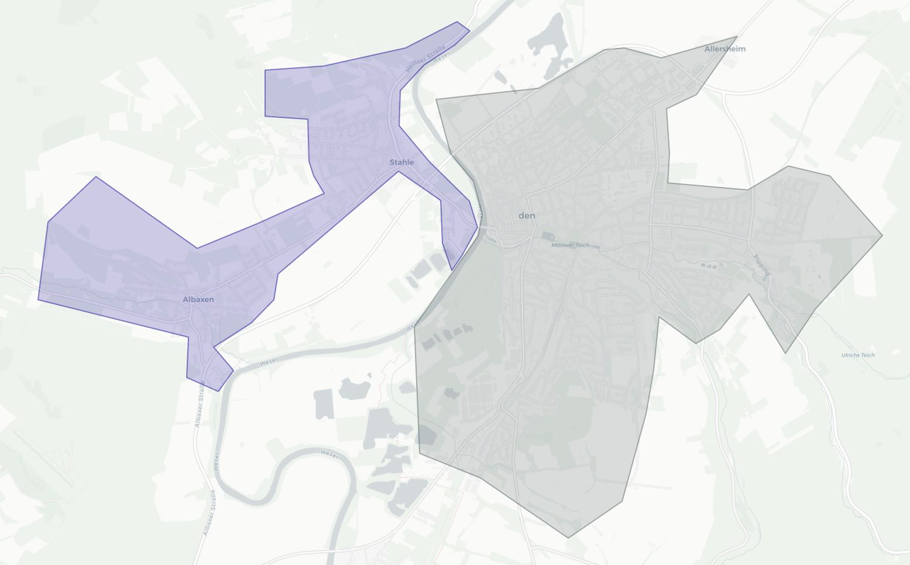

##########
Scangebiet
##########

Nachfolgende Screenshots zeigen euch, in welchen Gebieten wir Pokemon und Pokestops scannen und wo die Grenzen verlaufen.

|

Pokemon
"""""""

`Gebiet Pokemonscan <https://raw.githubusercontent.com/adrian-s315/A-Pogo-Map-Hol/master/build/html/_sources/holzmindenpokemonarea.JPG>`_

Pokestops
"""""""""

`Gebiet Pokestopscan Holzminden <https://raw.githubusercontent.com/adrian-s315/A-Pogo-Map-Hol/master/build/html/_sources/holzmindenpokestoparea.JPG>`_

`Gebiet Pokestopscan Lüchtringen <https://raw.githubusercontent.com/adrian-s315/A-Pogo-Map-Hol/master/build/html/_sources/lüchtringenpokestoparea.JPG>`_

.. image:: images/lüchtringenpokestoparea.JPG
    :width: 700px
    :align: center
    :height: 614px
    :alt: Lüchtringen Pokestop Gebiet

`Gebiet Pokestopscan Höxter <https://raw.githubusercontent.com/adrian-s315/A-Pogo-Map-Hol/master/build/html/_sources/höxterpokestoparea.JPG>`_

.. image:: images/höxterpokestoparea.JPG
    :width: 700px
    :align: center
    :height: 614px
    :alt: Höxter Pokestop Gebiet
